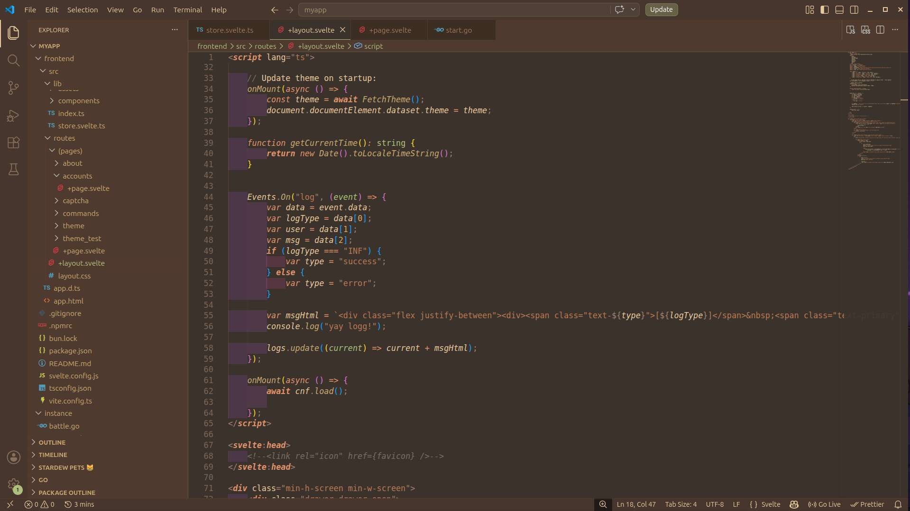

# Coffee Bean Theme ☕🌿

A soothing, minimal, and eye-friendly theme inspired by the rich hues of coffee beans. Perfect for developers who code better with a warm, inviting atmosphere!

---

## **Features**

- **Warm Coffee-Inspired Colors** ☕  
  Gentle browns and greens for a calming effect, ideal for long coding sessions.

- **Minimal and Aesthetic Design** 🎨  
  Simple yet elegant, with easy-to-read fonts.

- **Focused Environment** 🔍  
  Perfect contrast to keep your focus intact.

---

## **Installation**

1. Clone or download the theme repository.
2. Add the theme files (`.json`, `.css`, etc.) to your code editor.
3. Activate the Coffee Bean Theme in your editor's settings.
4. Enjoy coding in a warm and cozy atmosphere! 🌟

---

## **Preview**

---

## **Credits:**
A fork of https://github.com/KOWSIK-M/coffee-bean-theme with improvements made to suit my needs.

---

This project is Licensed under MIT, feel free to use as needed!